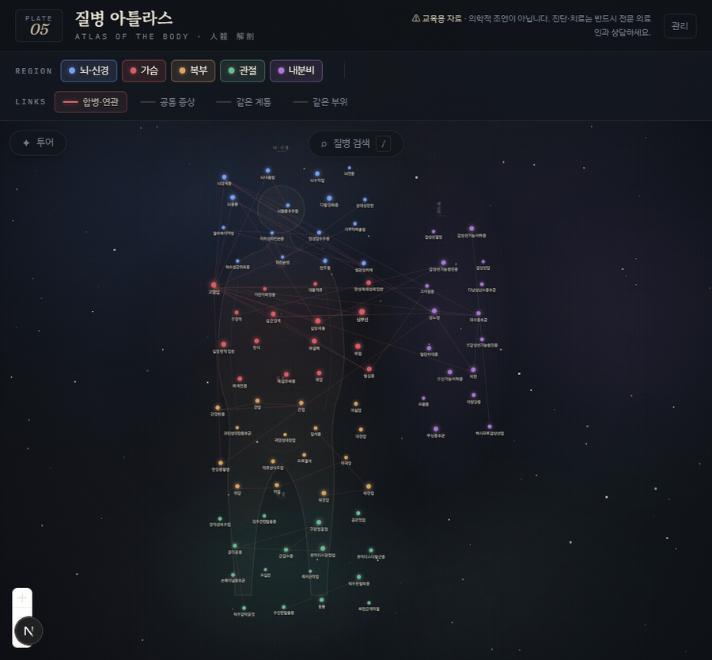

# 질병 아틀라스 (Disease Atlas)

> 인체 부위별 주요 질병을 **해부학적으로 배치된 관계 그래프**로 한눈에 보고,
> 용어·증상·치료법을 검색·열람하는 교육용 웹 아틀라스.

<p align="center">
  
</p>

밤하늘의 별자리처럼, 질병을 **있어야 할 신체 위치에** 배치합니다.
위는 뇌·신경, 가운데는 가슴, 아래는 복부, 양옆·다리는 관절, 오른쪽 띠는 내분비 —
그래프만 봐도 "어디가 아픈 병인지" 즉시 인지하도록 설계했습니다.

> ⚠️ **교육용 자료입니다. 의학적 조언이 아닙니다.** 진단·치료는 반드시 전문 의료인과 상담하세요.

---

## ✨ 주요 기능

- **🌌 해부학적 별자리 그래프** — 81개 질병을 5개 신체 부위 구역에 고정 배치. 흐릿한 인체 실루엣 위에 부위색으로 군집을 이룹니다. 연결이 많은 질병일수록 노드가 큽니다.
- **🔗 4가지 관계 엣지** — 질병 사이의 연결선을 네 기준으로 파생하고 필터로 켜고 끕니다.
  - `합병·연관` (수동 큐레이션) · `공통 증상` · `같은 계통` · `같은 부위`
  - 기본은 핵심 관계(합병·연관)만 표시 — 선이 너무 많으면 별자리가 실타래가 되니까요.
- **🩺 상세 패널** — 노드를 클릭하면 의학용어·부위·계통·증상·치료법·관련 질환을 한 패널에서. 관련 질환을 누르면 그래프가 해당 노드로 부드럽게 이동합니다.
- **🔍 퍼지 검색** — `/` 키로 검색창 호출, 질병명을 오타까지 감안해 찾고 즉시 점프 (Fuse.js).
- **✦ 가이드 투어** — "치매로 가는 길", "떨림의 정체", "심장에서 뇌까지" 등 큐레이션된 스토리를 단계별로 따라가며 질병 간 연결을 학습합니다.
- **🎛 부위 필터** — 상단 칩으로 특정 부위만 골라 보기.
- **🛠 관리자 CRUD** (`/admin`) — 코드 수정 없이 웹에서 질병·증상·계통·관계를 추가·수정·삭제. 단일 비밀번호 로그인.

---

## 🧱 기술 스택

| 영역 | 사용 기술 |
|------|-----------|
| 프레임워크 | **Next.js 16** (App Router, React 19, Turbopack) |
| 그래프 | **React Flow** (`@xyflow/react`) — 고정 좌표 배치 + 커스텀 노드 + 줌/팬 |
| 검색 | **Fuse.js** 클라이언트 퍼지 검색 |
| ORM / DB | **Prisma 7** + **PostgreSQL** (배포: Neon) |
| 스타일 | **Tailwind CSS v4** |
| 인증 | 관리자 단일 비밀번호 (env) |
| 배포 | **Vercel** |
| 언어 | 한국어 UI |

---

## 🗂 데이터 모델

```
BodyPart ──┐
           ├─< Disease >─┬─ DiseaseSymptom >── Symptom
Category ──┘             └─ DiseaseRelation (합병·연관, 자기참조)
```

| 모델 | 설명 |
|------|------|
| `BodyPart` | 신체 부위 — 그래프 배치 구역(`layoutZone`)과 부위색 결정 (뇌·신경 / 가슴 / 복부 / 관절 / 내분비) |
| `Category` | 계통·분류 — 감염성 / 자가면역 / 종양 / 대사·내분비 / 퇴행성 / 혈관성 / 정신·신경 / 염증성 |
| `Disease` | 질병 본체 — 의학용어·설명·치료법·부위·계통 |
| `Symptom` | 증상 마스터 (여러 질병이 공유 → 공통 증상 엣지의 근거) |
| `DiseaseSymptom` | 질병 ↔ 증상 다대다 |
| `DiseaseRelation` | 합병·연관 질환의 명시적 링크 (자동 파생이 아닌 수동 관계) |

**시드 규모:** 질병 81 · 부위 5 · 계통 8 · 수동 관계 50.

엣지는 서버에서 결정적(deterministic) 순수 함수(`src/lib/atlas-layout.ts`)로 한 번에 계산해 클라이언트로 넘깁니다. 같은 입력이면 항상 같은 좌표·엣지가 나오므로 서버/클라이언트 렌더가 어긋나지 않습니다.

---

## 🚀 로컬 실행

> DB가 PostgreSQL이라 `DATABASE_URL`이 있어야 실행됩니다. 무료 [Neon](https://neon.tech) dev 브랜치를 권장합니다.

```bash
# 1. 의존성 설치 (postinstall에서 prisma generate 자동 실행)
npm install

# 2. 환경변수 설정
cp .env.example .env
#   DATABASE_URL=postgres://...        (Neon 풀링 엔드포인트)
#   ADMIN_PASSWORD=...                 (관리자 로그인 비밀번호)

# 3. 스키마 적용 + 시드 (upsert 방식이라 재실행해도 안전)
npm run db:deploy
npm run db:seed

# 4. 개발 서버
npm run dev          # http://localhost:3000
```

| 스크립트 | 설명 |
|----------|------|
| `npm run dev` | 개발 서버 (Turbopack) |
| `npm run build` / `start` | 프로덕션 빌드 / 실행 |
| `npm run db:deploy` | 마이그레이션 적용 (`prisma migrate deploy`) |
| `npm run db:seed` | 시드 데이터 주입 (idempotent) |
| `npm run db:studio` | Prisma Studio |
| `npm run test` | 단위 테스트 (`tsx --test`) — 레이아웃·시드·투어 |
| `npm run lint` | ESLint |

관리자 페이지: [`/admin`](http://localhost:3000/admin) — `ADMIN_PASSWORD`로 로그인.

---

## 📁 프로젝트 구조

```
src/
├─ app/
│  ├─ page.tsx              # Atlas 메인 (서버에서 그래프 계산 → 클라이언트)
│  └─ admin/                # 관리자 로그인 + CRUD (서버 액션)
├─ components/
│  ├─ atlas/                # AtlasFlow, DiseaseNode, DetailPanel, Silhouette,
│  │                        #   Starfield, SearchBox, FilterBar, TourMenu, TourCard
│  └─ admin/                # CategoryPanel, DiseasePanel, SymptomPanel, RelationPanel ...
└─ lib/
   ├─ atlas-data.ts         # DB → 그래프 데이터 조회
   ├─ atlas-layout.ts       # 해부학적 노드 배치 + 엣지 파생 (순수 함수)
   ├─ tours.ts              # 가이드 투어 큐레이션
   └─ auth.ts               # 관리자 인증
prisma/
├─ schema.prisma            # 데이터 모델
├─ seed-data.ts             # 시드 콘텐츠 (질병·증상·관계)
└─ migrations/
docs/                       # 설계 문서 + 데모 미디어
```

---

## ☁️ 배포

Vercel + Neon Postgres. 상세 절차는 [`DEPLOY.md`](DEPLOY.md) 참고.

빌드 시 `postinstall`에서 `prisma generate`가 자동 실행됩니다.

---

## ⚠️ 면책 고지

이 사이트의 모든 콘텐츠는 **교육·정보 제공 목적**이며 의학적 진단이나 치료 권고가 아닙니다.
콘텐츠 정확성의 책임은 관리자에게 있으며, 건강 관련 결정은 반드시 전문 의료인과 상담하세요.
